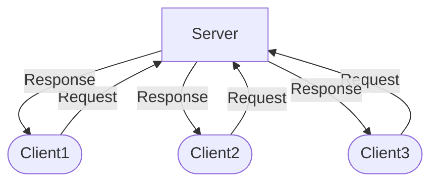
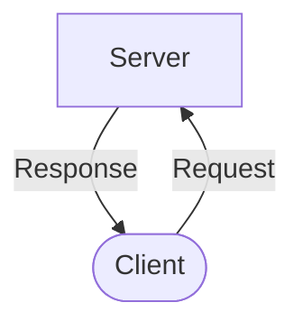
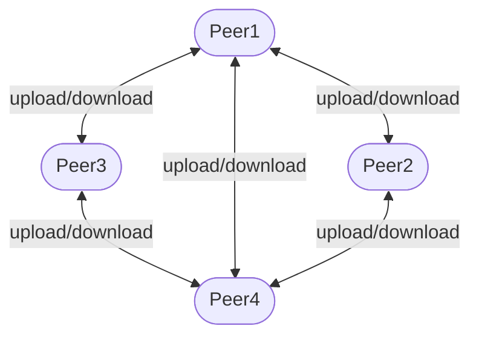
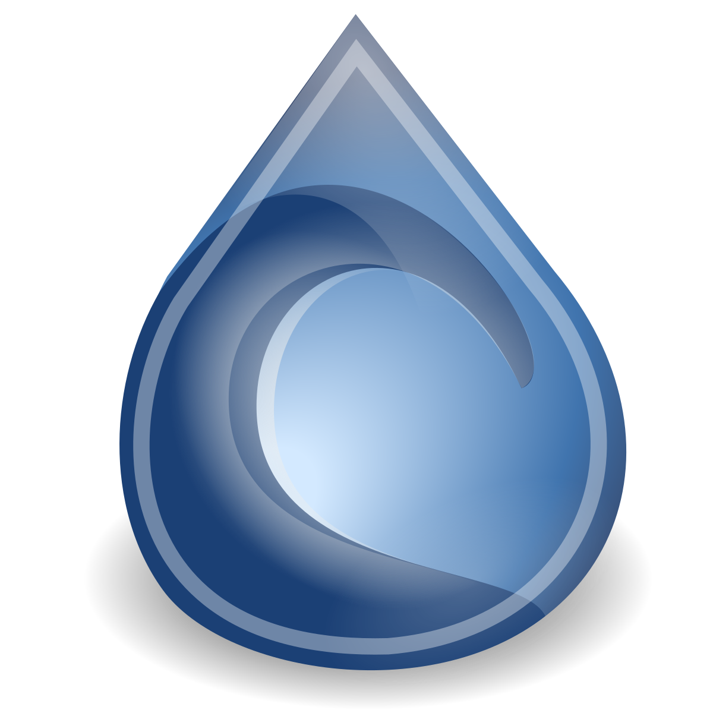
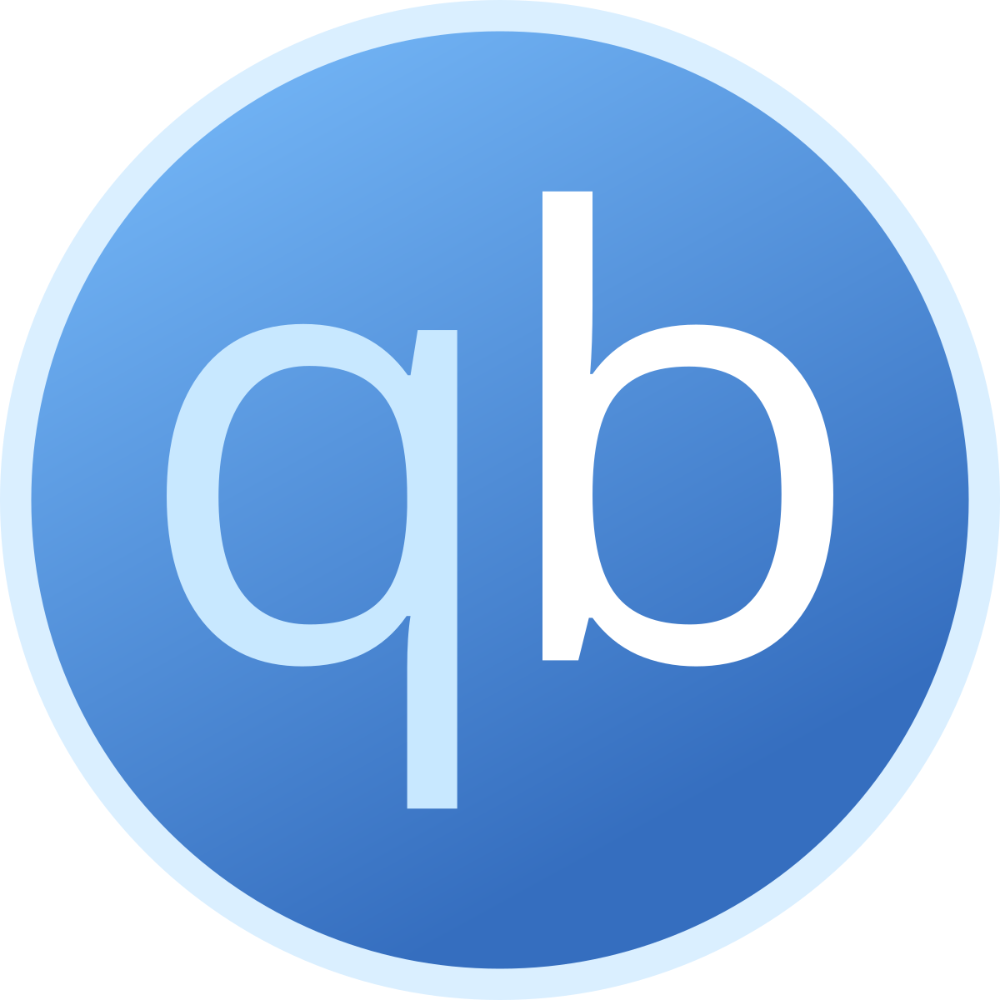
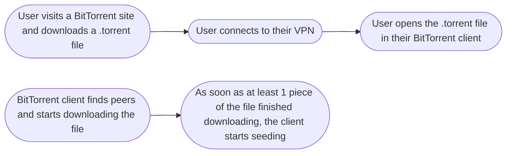
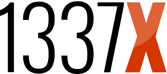
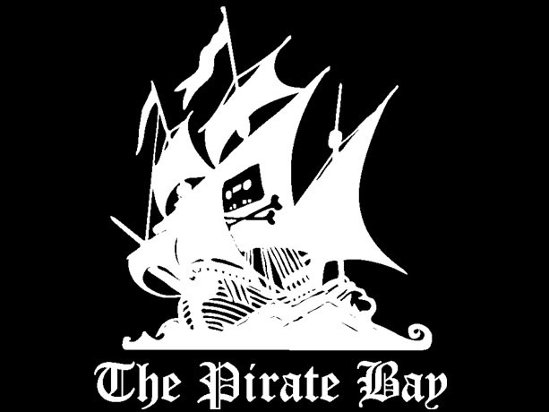
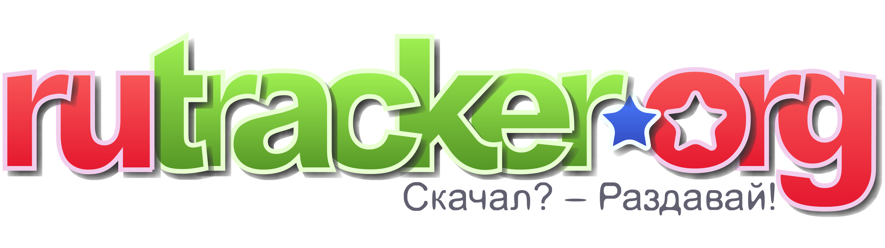

# Piracy 101

<!--
The last comment block of each slide will be treated as slide notes. It will be visible and editable in Presenter Mode along with the slide. [Read more in the docs](https://sli.dev/guide/syntax.html#notes)
-->

---
---

# About me
<ul>
<li v-click>
Mora, they/them.
</li>
<li v v-click>
grew up in the golden age of piracy in Serbia - end of 90s, early 2000s.
</li>
<li v v-click>
taught how to torrent by my peers.
</li>
<li v v-click>
torrenting since ca 2005.
</li>
<li v v-click>
not an expert.
</li>
<li v-click class="mt-8">
Feel free to interrupt at the end of any slide to correct me!
</li>
</ul>

<!--
You can have `style` tag in markdown to override the style for the current page.
Learn more: https://sli.dev/features/slide-scope-style
-->

---
layout: two-cols
layoutClass: gap-16
---

# What is a centralized network?
<ul>
<li v v-click>
classic client-server model
</li>
<li v v-click>
server hosts the file
</li>
<li v v-click>
client requests to download the file
</li>
<li v v-click>
server sends the file to the client
</li>
<li v v-click>
server is the supplier, client is the consumer
</li>
</ul>

::right:: 

---
layout: two-cols
layoutClass: gap-16
---

# What is a p2p network?
<ul>
<li v v-click>
decentralized
</li>
<li v v-click>
each node (peer) is both a supplier and a consumer
</li>

<li v-click class="mt-4">
reduced server and network impact
</li>
<li v-click class="ml-8">
no single point of failure
</li>

<li v-click class="mt-4">
used for both freeware/open-source and piracy
</li>
<li v v-click>
popularized by Napster and Limewire
</li>

<li v-click class="mt-16">
Q: which p2p clients did you use and for what?
</li>
</ul>

::right::

---
layout: two-cols
layoutClass: gap-16
---

# BitTorrent

<ul>
<li v-click>
since 2001
</li>
<li v-click>
communication protocol for p2p sharing
used by BitTorrent clients
</li>
<li v-click>
clients are free and exist for all OS and devices
</li>
<li v-click>
a peer currently uploading a file is called a "seed"
</li>
<li v-click>
a peer currently downloading a file is called a "leech"
</li>
<li v-click>
qBittorrent, Deluge, Transmission etc.
</li>

<li v-click class="mt-12">
Q: which clients do you use?
</li>
</ul>

::right::

---
---

# Usual flow of using BitTorrent

 
 

---

# BitTorrent file pieces

<ul>
<li v-click>
each file split into <i>pieces</i>
</li>
<li v-click>
each piece has a hash
</li>
<li v-click>
pieces are seeded/leeched in either random order or rarest-first
</li>
<li v-click class="mt-4">
"swarming" downloads 
</li>
<ul class="ml-4 mb-4">
<li v-click>
clients can download different pieces of a single file from different peers
</li>
<li v-click>
file download speed does not depend on upload speed of a single seed
</li>
</ul>
<li v-click>
seeding a file starts as soon as the peer has at least one <i>piece</i>
</li>
</ul>

---
layout: two-cols
layoutClass: gap-16
---

# .torrent files

<ul>
<li v-click>
tiny files
</li>
<li v-click class="mt-4">
contain metadata:
</li>
<ul class="ml-4 mb-4">
<li v-click>
file metadata & directory structure
</li>
<li v-click>
map of pieces
</li>
<li v-click>
hash values to check integrity
</li>
<li v-click>
sometimes trackers too
</li>
</ul>
<li v-click>
hosted on BitTorrent sites, can be directly downloaded from there
</li>
<li v-click>
can be opened in a torrent client
</li>
<li v-click class="mt-4">
alternative: Magnet Link - same data as a .torrent file, but formatted as a single URI string
</li>
</ul>

::right::

---

# BitTorrent sites

<ul>
<li v-click>
host .torrent files
</li>
<li v-click>
tend to operate trackers too
</li>
<li v-click>
some are specialized, some are search engines for other sites
</li>
</ul>

<ul>
<li v-click>
Q: which BitTorrent sites do you use?
</li>
<li v-click mt-4>
Resource: <a href="https://www.reddit.com/r/Piracy/wiki/megathread">r/piracy megathread</a>
</li>
</ul>

---

# Trackers

<ul>
<li v-click>
a list of seeders
</li>
<li v-click>
used by the peers to find seeders to connect to
</li>
<li v-click>
private and public trackers
</li>
</ul>

---

# Legal Situation

<ul>
<li v-click>
BitTorrent sites get raided and shut down in some countries
</li>
<li v-click>
In many countries, there is no enforcement of copyright laws against torrenting (eg. Serbia)
</li>
<li v-click>
direct downloads are generally unproblematic, p2p sharing tends to have more legal consequences (because of seeding)
</li>
<li v-click>
with a VPN, a user of a p2p network is protected from legal consequences
</li>
<li v-click>
Specialized legal companies in Germany pursue legal action against individuals on behalf on copyright holders
</li>

</ul>

---
---

# Typical case in Germany

<ul>
<li v-click>
a person uses BitTorrent to download 1 music track 
</li>
<li v-click>
a legal firm observes torrent trackers for this specific track
</li>
<li v-click>
the legal firm notices a new seeder
</li>
<li v-click>
They contact german ISPs to get the person's address and name via their IP 
</li>
<li v-click>
the legal firm sends a letter to the person, claiming the person did damage in value of 500 euros. They calculate the damages as follows:
</li>
<ul class="ml-8">
<li v-click>
1 digital copy of a music track costs eg. 5 euros
</li>
<li v-click>
the accused has seeded the track to 10 other people, who seeded the track to 10 other people each. 
</li>
<li v-click>
that makes 5x10x10 = 500 euros of damages to the copyright holder.
</li>
</ul>
<li v-click>
the accused either:
</li>
<ul class="ml-8">
<li v-click>
just pays the fine
</li>
<li v-click>
gets a lawyer and comes to an agreement to pay a fraction of the demanded sum
</li>
</ul>
<li v-click class="mt-4">
Q: did you have legal consequences for piracy in Germany?
</li>
</ul>

---
---
# Safety: Malware 
<ul>
<li v-click>
software (installation files, executables) are more liable for containing malware
</li>
<li v-click>
file types that very rarely contain malware:
</li>
<ul class="ml-8">
<li v-click>
music files (MP3, AAC, WAV, FLAC)
</li>
<li v-click>
video files (MP4, MOV, AVI, WMV, MKV)
  </li>
<li v-click>
images (JPEG, PNG, WEBP, GIF, TIFF)
  </li>
</ul>
<li v-click>
using safe, well known sites should keep you safe enough
</li>
<li v-click>
using an up-to-date anti-malware software helps
</li>
<li v-click>
Windows and Android are the most vulnerable OS
</li>
</ul>

---
---

# VPN services
<ul>
<li v-click>
all network from your device goes first to a proxy by the service provider, which encrypts it and then sends it to its goal
</li>
<li v-click>
your ISP cannot see your network activity
</li>
<li v-click>
VPN services are not end-all be-all for internet security. But for accessing region-blocked content and p2p, it's safe enough.
</li>
<li v-click>
VPN service providers
</li>
<ul class="ml-8">
<li v-click>
Mullvad 
</li>
<ul class="ml-8">
<li v-click>
5e/month
</li>
<li v-click>
can be bought in ProxyStore in Connewitz
</li>
</ul>
<li v-click>
Surfshark 
</li>
<ul class="ml-8">
<li v-click>
2-15e/month
</li>
</ul>
</ul>
<li v-click class="mt-8">
Q: which VPN service do you use?
</li>
</ul>

---
---

# Q&A and Discussion time!

---
---

# Workshop
- set up Surfshark VPN
- set up a torrent client of choice (qBitTorrent for Windows/Linux, Transmission for Mac)
- leech & seed your first file!